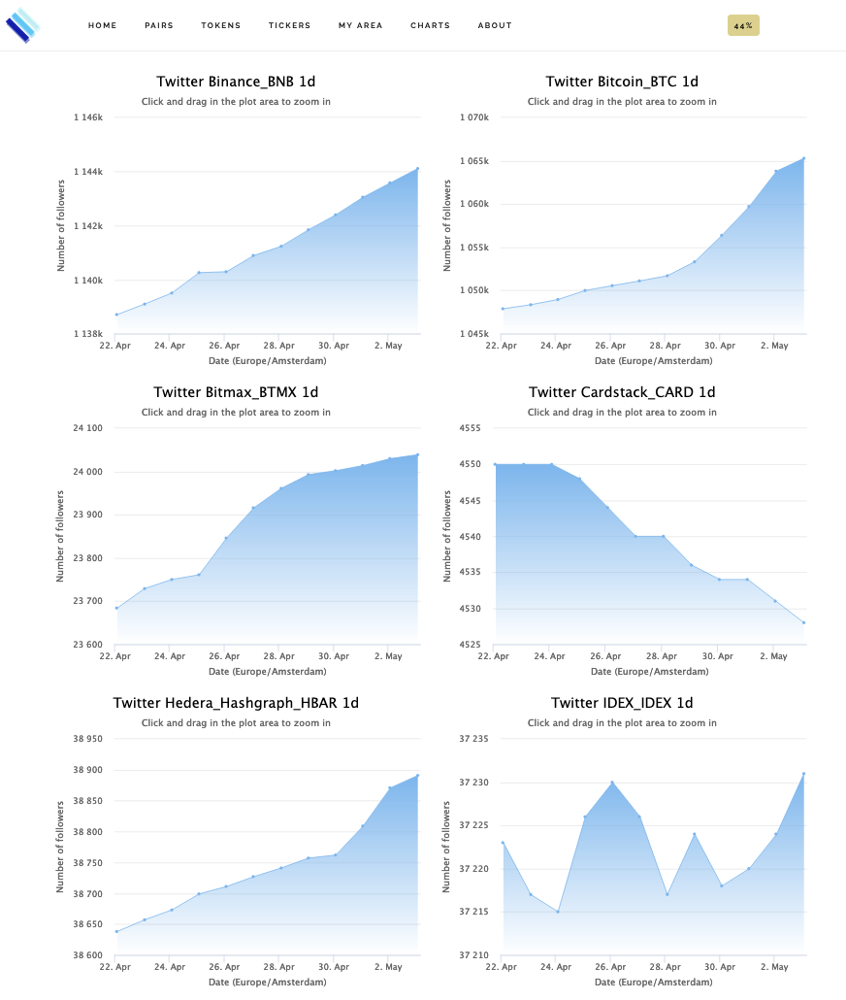
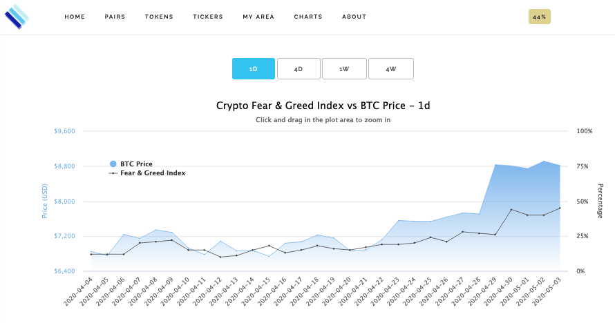
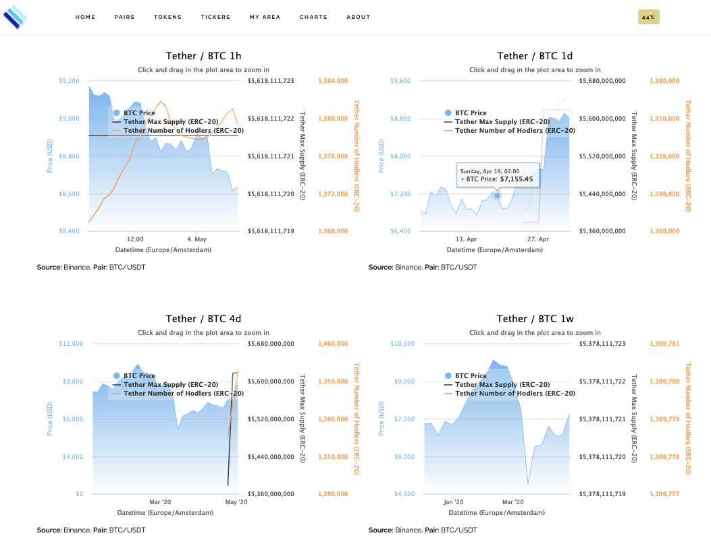
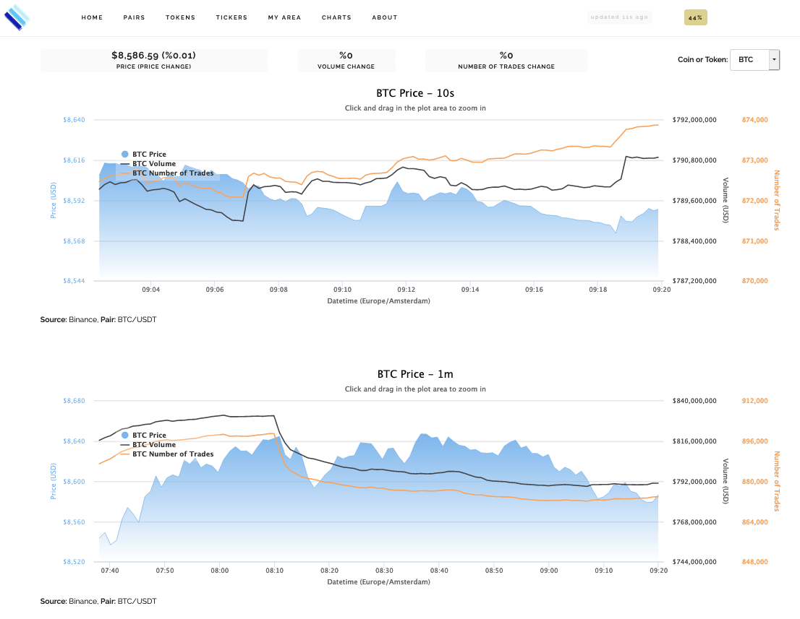
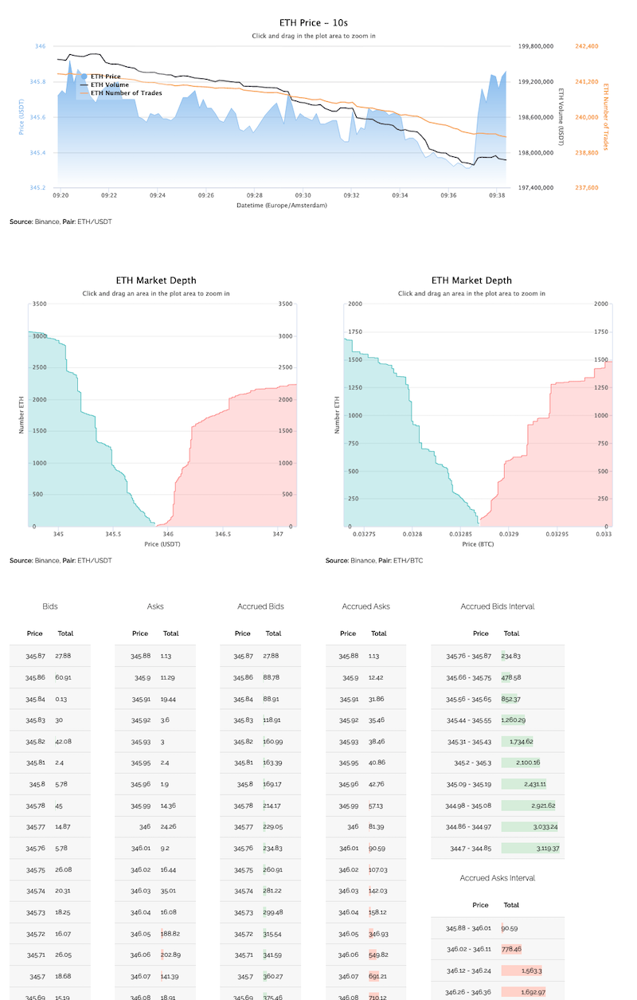
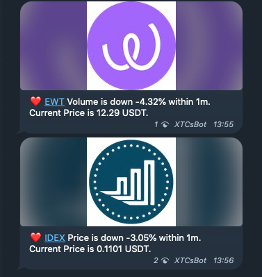
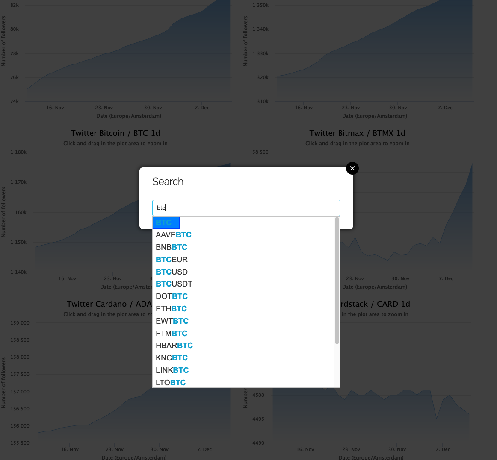

# XTCryptoSignals

**XTCryptoSignals** is a Python library that includes the following 3 services:

* #### Tasks

    * **Data collection** of crypto-currencies pairs such as BTC/USDT, ETH/BTC or 
    any other pair that is supported by the Exchange API.
    * A **Signals** service based on setup rules to send real-time alerts about 
    price, price change, trading volume or market sentiment sending Web Push 
    Notifications to the client browser (Firefox, Chrome) or/and to Telegram Channel.
    * **Market Depth**, **Content** and **Data** fetching Tasks.

(Web Push Notifications are implemented with [ServiceWorker](https://developer.mozilla.org/en-US/docs/Web/API/ServiceWorkerRegistration/showNotification) 
that is compatible with the most known web browsers.)

* #### RESTFul Server API
    * Restful interface that exposes API entry points to get desired crypto-currencies data.
    * SocketIO Server to broadcast real-time data to clients.

* #### Website

## Roadmap

* [x] Add crypto-currencies exchanges (Dec 2018)
* [x] Implement RESTFul API and socket.io to access price data in real time (Jan 2019)
* [x] Build website (Jan 2019)
* [x] Add Gunicorn to make it production ready (March 2019)
* [x] Building Unit, functional and end-to-end testing for existing and future features (Jan 2019)
* [x] User account creation, Session and Assets Management (Oct 2019)
* [x] Implement web push notification signals for price range, price change, 
trading volume, price sentiment, etc (July 2019)
* [x] Implement Telegram bot to broadcast notifications (Feb 2020)
* [x] Create nice features and make platform improvements on-the-fly (From 2020 onwards)


## Getting Started

### Pre-requisites

* [Python >= 3.7](https://www.python.org/downloads)
* [Redis](https://redis.io/download)
* [MongoDB](https://www.mongodb.com)


## Installation

### Install from source
Clone project repository:
```bash
git clone https://github.com/pantunes/xtcryptosignals.git
cd xtcryptosignals
```

Setup Python virtual environment:
```bash
virtualenv venv -p python3
source venv/bin/activate
```

Install package in develop mode:
```bash
pip install -e .
```
(Dependencies will be installed automatically from [requirements.txt](requirements.txt))

### Path to the settings file
Before running `xt-server`, `xt-client`, `xt-tasks` and tests the env var `SETTINGS_APP`
should be set to the path of its settings file.  
This can be achieved inline `SETTINGS_APP=<path to configuration>` followed by the app cli or 
executing `export SETTINGS_APP=<path to configuration>` before running any of the command line
.  

Example of `xt-client` settings file [client.dev.env](xtcryptosignals/config/client.dev.env):
```bash
SECRET_KEY='bRdzq6ZMQ;HGB3JWVxs&WQ4>6r{'
GA_TRACKING_ID='UA-12341343-2'
```

Example of `xt-server` or `xt-tasks` settings file [server.dev.env](xtcryptosignals/config/server.dev.env):
```bash
SECRET_KEY='MfYfEeom6)EyhcKcFh@+WGx8hvhP/,K67hA6'
CORS_ALLOWED_ORIGINS=('https://mydomain.com',)
MONGODB_HOST='localhost'
MONGODB_PORT=27017
MONGODB_NAME='MyDatabaseName'
```

Run tests:
```bash
SETTINGS_APP=server.dev.env python setup.py test
# or
SETTINGS_APP=server.dev.env pytest
```

### Install from PyPi
Create folder project:
```bash
mkdir xtcryptosignals
cd xtcryptosignals
```

Setup Python virtual environment:
```bash
virtualenv venv -p python3
source venv/bin/activate
```

Install package:
```bash
pip install xtcryptosignals
```

#### Run database migrations
It will populate some collections with data:
```bash
FLASK_ENV=development SETTINGS_APP=server.dev.env mongodb-migrate --url mongodb://127.0.0.1:27017/XTC-Dev --migrations xtcryptosignals/server/migrations/
```

### Install from docker-compose (the simplest way):
Clone project repository:
```bash
git clone https://github.com/pantunes/xtcryptosignals.git
cd xtcryptosignals
```
Create multi-container Docker Applications:
```bash
docker-compose build
```
Nothing more is necessary...

## Tasks
### Start service

#### Development:

```bash
SETTINGS_APP=server.dev.env xt-tasks

# to test 1 tick
SETTINGS_APP=server.dev.env xt-tasks --test

```

#### Production:

```bash
SETTINGS_APP=server.prod.env xt-tasks --log-ticker-minimal
```

To get a list of supported exchanges:
```bash
SETTINGS_APP=server.prod.env xt-tasks --list-config exchanges
```
```bash
binance
binance_dex
uphold
okex
idex
switcheo
hotbit
bibox
okcoin
bithumb
coinbene
dcoin
bitmax
bilaxy
bitstamp
kucoin
coinbase_pro
```
(Drop [me](mailto:pjmlantunes@gmail.com) an e-mail if you want support for a new 
exchange or please contribute to this project creating a pull request)

Command line help:
```bash
xt-tasks --help
```
```bash
Usage: xt-tasks [OPTIONS]

  Use this tool to start all or part of the tasks.

Options:
  --test                          Process 1 iteration for all configured coins
                                  and/or tokens. (Useful for testing purposes)

  --list-config [exchanges|currencies]
                                  List 'exchanges' or 'currencies' (coins or
                                  tokens) per exchange that are currently
                                  supported.

  -t, --task [cfgi|project|tether|ticker|notifications|order_book]
                                  Task to be executed. If this parameter is
                                  omitted all tasks will be started

  -q, --queue TEXT                Queue name to execute indicated tasks.
  --disable-ticker-messaging      Disable ticker message broadcasting.
  --log-ticker-minimal            Only log ticker errors and important
                                  warnings in stdout.

  --version                       Show version.
  -h, --help                      Show this message and exit.
```

### Setup

There is already an initial setup with some crypto-currencies (coins and tokens) 
that can be added or/and removed in [settings_exchanges.py](xtcryptosignals/settings_exchanges.py).

```python
BIBOX: {
    'pairs': [
        ('ONT', 'USDT'),
        ('ONT', 'BTC'),
        ('ONT', 'ETH'),
        ('NEO', 'USDT'),
        ('NEO', 'BTC'),
        ('NEO', 'ETH'),
        ('LTC', 'USDT'),
        ('LTC', 'BTC'),
        ('CARD', 'ETH'),
    ]
}

UPHOLD: {
    'pairs': [
        ('BTC', 'USD'),
        ('ETH', 'USD'),
        ('LTC', 'USD'),
        ('XRP', 'USD'),
    ]
}
```

Initial setup to create dynamic MongoDB collections for data segmentation categorized 
by Exchanges pooling frequency in [settings.py](xtcryptosignals/settings.py).
```python
HISTORY_FREQUENCY = (
    '10s', '30s', '1m', '10m', '30m', '1h', '2h', '3h', '4h', '12h', '1d', '4d', 
    '1w', '2w', '4w', '12w', '24w', '1y',
)
```

### Results
The Ticker service is highly performant as can take advantage of multi-processing multi-core CPU.  

### RESTFul Server API
### Start service

#### Development:

```bash
FLASK_ENV=development SETTINGS_APP=client.dev.env xt-server
```

Swagger API endpoints accessible at `http://127.0.0.1:5000/apidocs`:    


#### Production:

```bash
FLASK_ENV=production SETTINGS_APP=client.prod.env xt-server
```


## Website
### Start service

#### Development:

```bash
FLASK_ENV=development SETTINGS_APP=client.dev.env xt-client
```

#### Production:
```bash
FLASK_ENV=production SETTINGS_APP=client.prod.env xt-client --num-workers=N
```
N corresponds to the number of workers to be spinned up.  

## Run all services at once

#### Embed command line:
```bash
xt-all --help
```

```bash
Usage: xt-all [OPTIONS] [copy-config-files|start|stop|restart]

Options:
  -h, --help  Show this message and exit.
```
For Production enviroment `xt-all copy-config-files` should be executed on first place 
to copy default config files to the folder `/config`.  
The configuration should be reviewed and changed, before running `xt-all start`
to start all 3 services: `xt-server`, `xt-client` and `xt-tasks`.  

#### Docker Compose (the simplest way):
With the following command all services will be started and running:

```bash
docker-compose up
```
Access the URL `http://127.0.0.1:5000` to load the Platform client UI, nothing more is necessary...

## Screenshots

Open the browser with the URL `http://127.0.0.1:8000`:

**Overview** | **Pairs**
:-------------------------:|:-------------------------:
 | 
**Coins/Tokens** | **Dark Theme** 
 | 
**Login** | **Portfolio**
 |  
**Alerts Setup** | **Web Push Notification** | 
 | 
**Twitter Chart** | **Crypto Fear & Greed Index Chart** | 
 | 
**Tether Chart** | **Coin / Token Chart** | 
 | 
**Market Depth** | **Telegram Notifications** | 
 | 
**Spotlight Search** | | 
 |

## Example of added Feature
Pull Request to show how easy is to [Add Kyber Network, Aave and Ren Projects/Tokens](https://github.com/pantunes/xtcryptosignals/commit/95e1ec9cda86e5b457343163068ad164f8df81aa).

## Disclaimer

This project is work in progress and when it comes to trading use it at your own risk.

## License

This project is licensed under the [GNU](https://www.gnu.org/licenses/gpl-3.0.en.html) License.

## Contact

Through the website [xtcryptosignals.com](https://xtcryptosignals.com/ticker/tokens/10s#contact).  

## Acknowledgments

  
Thanks to [Jetbrains](https://www.jetbrains.com/?from=xtcryptosignals) in order to 
support us with an Open Source license.

## Donation

In case this project helped you in some way I'm accepting a small donation to keep this open-source project on-🔥 :
- BTC: bc1qheg9zjhezsvnzywvnj9tunsj39llslqp33ekrs
- ETH: 0x2e9B4409d40d2605361Ea1278B1514C74c66Eac3

