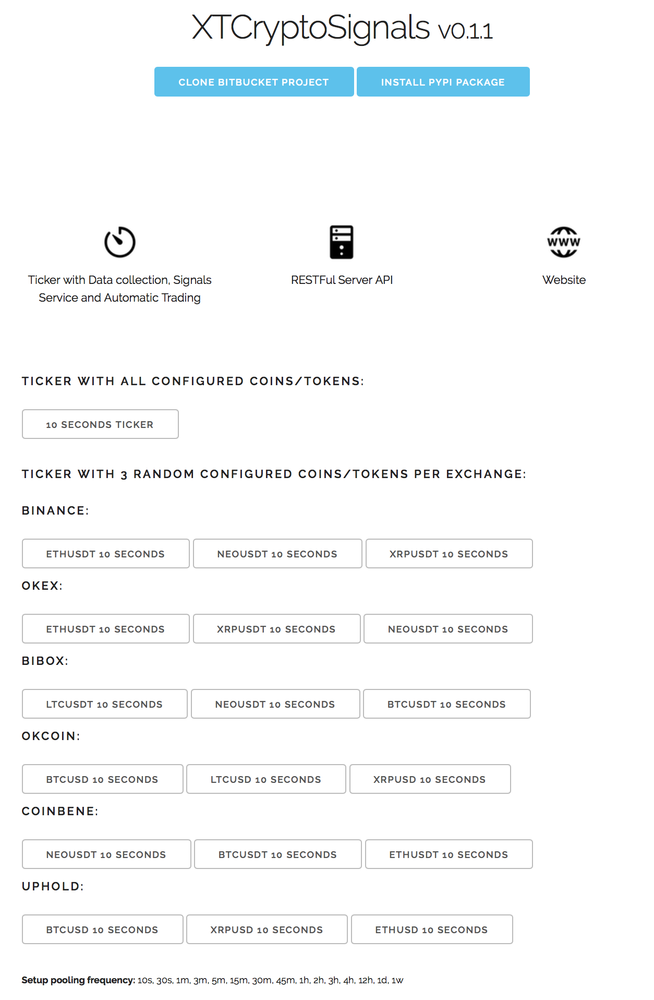
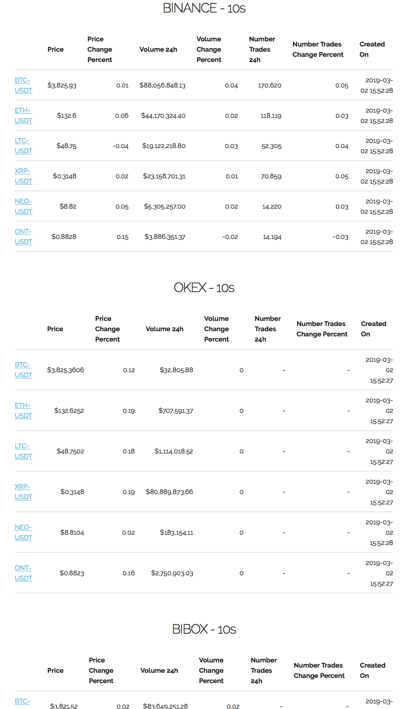
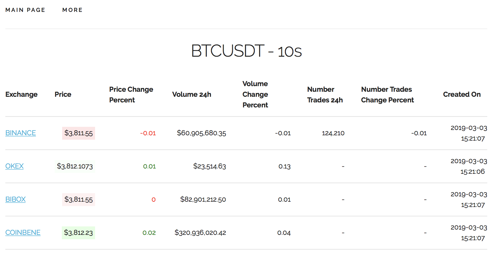
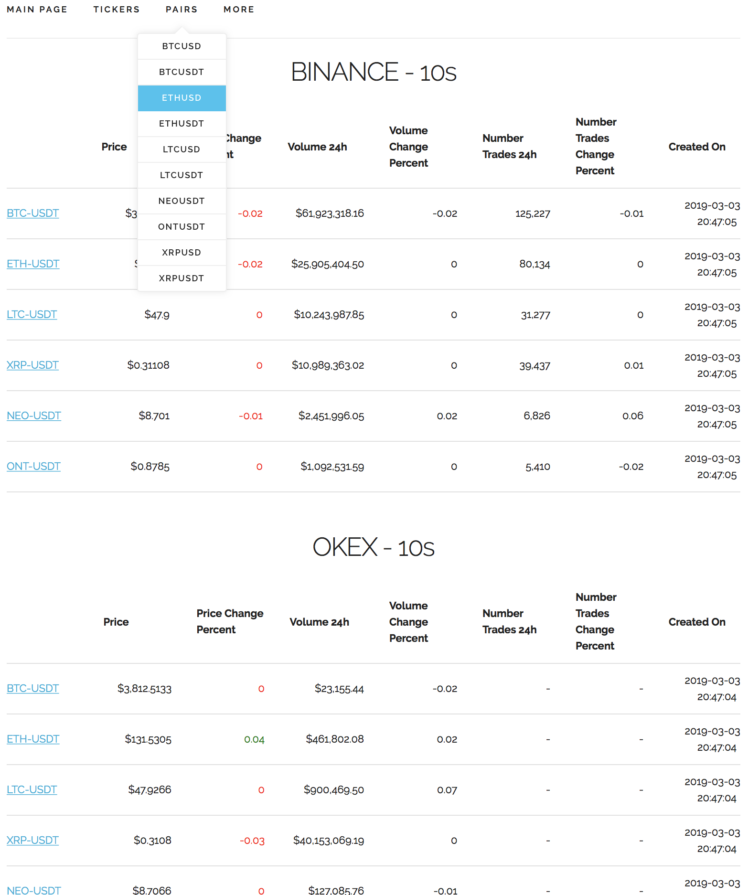
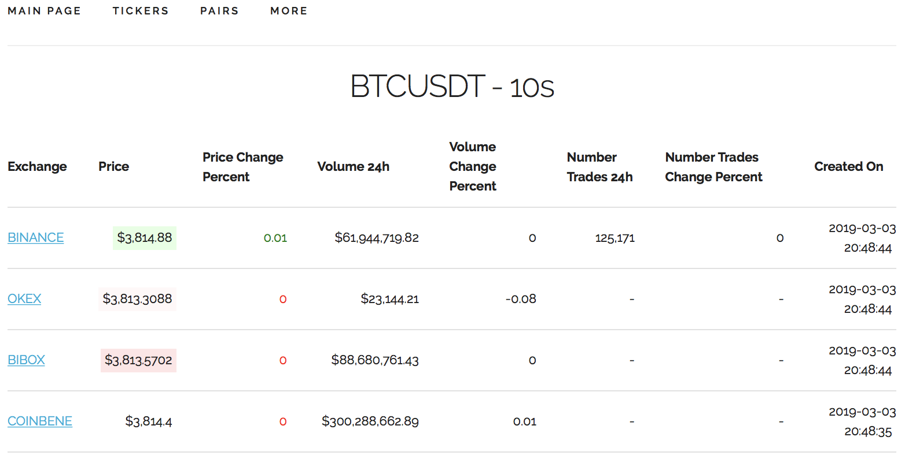

# XTCryptoSignals

**XTCryptoSignals** is a Python library that includes the following services:

### Ticker

* **Data collection** of crypto-currencies pairs such as BTC/USDT, ETH/BTC or any other pair that is supported by the Exchange API
* A **Signals** service based on setup rules to send real-time alerts about price, price change, trading volume or market sentiment through E-mail or Push Notifications to the browser or mobile app
* **Automatic trading**

### RESTFul Server API
* Restful interface that exposes API entry points to get desired crypto-currencies data and runs as well SocketIO Server.
(This service must be running to allow the Ticker to send real-time data to the Website, using SocketIO)

### Website
* Website to show some of the platform functionalities. 

## Roadmap

* [x] Add crypto-currencies exchanges (Dec 2018)
* [x] Implement RESTFul API and socket.io to access price data in real time (Jan 2019)
* [x] Build website to use this platform (From Jan 2019)
* [ ] Build Unit, functional and end-to-end testing (From Jan 2019)
* [ ] Setup notification rules for price range, price change, trading volume, price sentiment (Feb-Mar 2019)
* [ ] Implement e-mail and web browser push notifications signals (Apr 2019)
* [ ] Build iOS app (May-Jul 2019)
* [ ] Implement automatic trading (Aug 2019)


## Getting Started

### Pre-requisites

* [Python >=3.6](https://www.python.org/downloads)
* [Redis](https://redis.io/download)
* [MongoDB](https://www.mongodb.com)


## Installation

### Install from source
Clone project repository
```bash
hg clone ssh://hg@bitbucket.org/pantunes/xtcryptosignals
cd xtcryptosignals
```

Setup Python virtual environment:
```bash
virtualenv venv -p python3
source venv/bin/activate
```

Install package
```bash
pip install -e .
```
(Dependencies will be installed automatically from [requirements.txt](requirements.txt))

### Install from PyPi
Create folder project:
```bash
mkdir xtcryptosignals
cd xtcryptosignals
```

Setup Python virtual environment:
```bash
virtualenv venv -p python3
source venv/bin/activate
```

Install package:
```bash
pip install xtcryptosignals
```


## Ticker
### Start service

```bash
xt-ticker
```

Run without Celery (for testing purposes):
```bash
xt-ticker --testing
```

To get a list of supported exchanges:
```bash
xt-ticker --list-config exchanges
```
```bash
binance
uphold
okex
idex
switcheo
hotbit
bibox
okcoin
bithumb
coinbene
```
(Drop [me](mailto:pjmlantunes@gmail.com) an email if you want a new one to be supported or contribute to this project creating a pull request)

Command line help
```bash
xt-ticker --help
```
```bash
Usage: xt-ticker [OPTIONS]

  Use this tool to collect data from configured coins or/and tokens from
  configured crypto-currencies exchanges.

Options:
  --testing                       Execute 1 iteration for all configured coins
                                  and/or tokens without Celery. (Useful for
                                  testing purposes)
  --list-config [exchanges|currencies]
                                  List 'exchanges' or 'currencies' (coins or
                                  tokens) per exchange that the tool currently
                                  supports.
  --enable-real-time-messaging    Enable SocketIO real-time crypto-data
                                  message broadcasting.
  --version                       Show version.
  -h, --help                      Show this message and exit.
```

### Setup

There is already an initial setup with some crypto-currencies (coins and tokens) that can be added or/and removed in [settings_exchanges.py](xtcryptosignals/settings_exchanges.py).

```python
BIBOX: {
    'pairs': [
        ('ONT', 'USDT'),
        ('ONT', 'BTC'),
        ('ONT', 'ETH'),
        ('NEO', 'USDT'),
        ('NEO', 'BTC'),
        ('NEO', 'ETH'),
        ('LTC', 'USDT'),
        ('LTC', 'BTC'),
        ('CARD', 'ETH'),
    ]
}

UPHOLD: {
    'pairs': [
        ('BTC', 'USD'),
        ('ETH', 'USD'),
        ('LTC', 'USD'),
        ('XRP', 'USD'),
    ]
}
```

Initial setup to create dynamic MongoDB collections for data segmentation categorized by Exchanges pooling frequency in [settings.py](xtcryptosignals/settings.py).
```python
HISTORY_FREQUENCY = (
    '10s', '30s', '1m', '10m', '30m', '1h', '3h', '6h', '12h', '24h', '1w',
)
```

### Results
The Ticker service uses multi-processing and it takes around 6 seconds to collect data of 70 crypto-currencies symbols pairs from 7 exchanges and save it in 11 collections in MongoDB.
(This performance figure depends on used hardware and Internet connection / latency)

### RESTFul Server API
### Start service

```bash
xt-server
```

## Website
### Start service

```bash
xt-client
```
Open the browser with the URL http://127.0.0.1:8000



10 seconds ticker page in the URL http://127.0.0.1:8000/ticker/10s



Displaying Tickers menu



Displaying Pairs menu



10 seconds ticker page for Bitcoin in the URL http://127.0.0.1:8000/ticker/BTCUSDT/10s



## Disclaimer
This project is work in progress and when it comes to trading use it at your own risk.


## License

[GNU](https://www.gnu.org/licenses/gpl-3.0.en.html)
