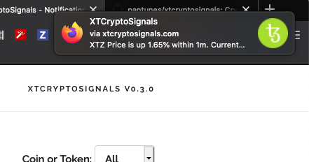

# XTCryptoSignals

**XTCryptoSignals** is a Python library that includes the following 3 services:

* #### Ticker

    * **Data collection** of crypto-currencies pairs such as BTC/USDT, ETH/BTC or 
    any other pair that is supported by the Exchange API.
    * A **Signals** service based on setup rules to send real-time alerts about 
    price, price change, trading volume or market sentiment sending Web Push 
    Notifications to the client browser (Firefox, Chrome).
    * **Automatic trading** *(in progress)*

(Web Push Notifications are implemented with [ServiceWorker](https://developer.mozilla.org/en-US/docs/Web/API/ServiceWorkerRegistration/showNotification) 
that is compatible with the most known web browsers.)

* #### RESTFul Server API
    * Restful interface that exposes API entry points to get desired crypto-currencies data.
    * SocketIO Server to broadcast real-time data to clients.

* #### Website

## Roadmap

* [x] Add crypto-currencies exchanges (Dec 2018)
* [x] Implement RESTFul API and socket.io to access price data in real time (Jan 2019)
* [x] Build website (From Jan 2019)
* [x] Add Gunicorn to make it production ready (March 2019)
* [x] Building Unit, functional and end-to-end testing for existing and future features (From Jan 2019)
* [x] User account creation, Session and Assets Management (From Oct 2019)
* [x] Implement web push notification signals for price range, price change, 
trading volume, price sentiment, etc (From July 2019)
* [ ] Implement automatic trading (From 2020)
* [ ] Build Mobile app (From 2020)


## Getting Started

### Pre-requisites

* [Python >= 3.7](https://www.python.org/downloads)
* [Redis](https://redis.io/download)
* [MongoDB](https://www.mongodb.com)


## Installation

### Install from source
Clone project repository:
```bash
hg clone ssh://hg@bitbucket.org/pantunes/xtcryptosignals
cd xtcryptosignals
```

Setup Python virtual environment:
```bash
virtualenv venv -p python3
source venv/bin/activate
```

Install package in develop mode:
```bash
pip install -e .
```
(Dependencies will be installed automatically from [requirements.txt](requirements.txt))

### Path to the settings file
Before running `xt-server`, `xt-client`, `xt-ticker` and tests the env var `SETTINGS_APP`
should be set to the path of its settings file.  
This can be achieved inline `SETTINGS_APP=<path to configuration>` followed by the app cli or 
executing `export SETTINGS_APP=<path to configuration>` before running any of the command line
.  

Example of `xt-client` settings file [client.dev.env](xtcryptosignals/config/client.dev.env):
```bash
SECRET_KEY='bRdzq6ZMQ;HGB3JWVxs&WQ4>6r{'
GA_TRACKING_ID='UA-12341343-2'
```

Example of `xt-server` or `xt-ticker` settings file [server.dev.env](xtcryptosignals/config/server.dev.env):
```bash
SECRET_KEY='MfYfEeom6)EyhcKcFh@+WGx8hvhP/,K67hA6'
CORS_ALLOWED_ORIGINS=('https://mydomain.com',)
MONGODB_HOST='localhost'
MONGODB_PORT=27017
MONGODB_NAME='MyDatabaseName'
```

Run tests:
```bash
SETTINGS_APP=server.dev.env python setup.py test
# or
SETTINGS_APP=server.dev.env pytest
```

### Install from PyPi
Create folder project:
```bash
mkdir xtcryptosignals
cd xtcryptosignals
```

Setup Python virtual environment:
```bash
virtualenv venv -p python3
source venv/bin/activate
```

Install package:
```bash
pip install xtcryptosignals
```


## Ticker
### Start service

#### Development:

```bash
SETTINGS_APP=server.dev.env xt-ticker --enable-messaging

# to test 1 tick
SETTINGS_APP=server.dev.env xt-ticker --test

```

#### Production:

```bash
SETTINGS_APP=server.prod.env xt-ticker --enable-messaging --log-minimal
```

To get a list of supported exchanges:
```bash
SETTINGS_APP=server.prod.env xt-ticker --list-config exchanges
```
```bash
binance
binance_dex
uphold
okex
idex
switcheo
hotbit
bibox
okcoin
bithumb
coinbene
dcoin
bitmax
bilaxy
```
(Drop [me](mailto:pjmlantunes@gmail.com) an e-mail if you want support for a new 
exchange or please contribute to this project creating a pull request)

Command line help:
```bash
xt-ticker --help
```
```bash
Usage: xt-ticker [OPTIONS]

  Use this tool to collect data from configured coins or/and tokens from
  configured crypto-currencies exchanges.

Options:
  --test                          Execute 1 iteration for all configured coins
                                  and/or tokens without Celery. (Useful for
                                  testing purposes)
  --list-config [exchanges|currencies]
                                  List 'exchanges' or 'currencies' (coins or
                                  tokens) per exchange that the tool currently
                                  supports.
  --enable-messaging              Enable real-time crypto data message broadcasting.
  --log-minimal                   Only log errors and important warnings in
                                  stdout.
  --version                       Show version.
  -h, --help                      Show this message and exit.
```

### Setup

There is already an initial setup with some crypto-currencies (coins and tokens) 
that can be added or/and removed in [settings_exchanges.py](xtcryptosignals/settings_exchanges.py).

```python
BIBOX: {
    'pairs': [
        ('ONT', 'USDT'),
        ('ONT', 'BTC'),
        ('ONT', 'ETH'),
        ('NEO', 'USDT'),
        ('NEO', 'BTC'),
        ('NEO', 'ETH'),
        ('LTC', 'USDT'),
        ('LTC', 'BTC'),
        ('CARD', 'ETH'),
    ]
}

UPHOLD: {
    'pairs': [
        ('BTC', 'USD'),
        ('ETH', 'USD'),
        ('LTC', 'USD'),
        ('XRP', 'USD'),
    ]
}
```

Initial setup to create dynamic MongoDB collections for data segmentation categorized 
by Exchanges pooling frequency in [settings.py](xtcryptosignals/settings.py).
```python
HISTORY_FREQUENCY = (
    '10s', '30s', '1m', '10m', '30m', '1h', '2h', '3h', '4h', '12h', '1d', '4d', 
    '1w', '2w', '4w', '12w', '24w', '1y',
)
```

### Results
The Ticker service is highly performant as can take advantage of multi-processing multi-core CPU.  

### RESTFul Server API
### Start service

#### Development:

```bash
FLASK_ENV=development SETTINGS_APP=client.dev.env xt-server
```

Swagger API endpoints accessible at `http://127.0.0.1:5000/apidocs`:    


#### Production:

```bash
FLASK_ENV=production SETTINGS_APP=client.prod.env xt-server
```


## Website
### Start service

#### Development:

```bash
FLASK_ENV=development SETTINGS_APP=client.dev.env xt-client
```

#### Production:
```bash
FLASK_ENV=production SETTINGS_APP=client.prod.env xt-client --num-workers=N
```
N corresponds to the number of workers to be spinned up.  

## Run all services at once

```bash
xt-all --help
```

```bash
Usage: xt-all [OPTIONS] [copy-config-files|start|stop|restart]

Options:
  -h, --help  Show this message and exit.
```
For Production enviroment `xt-all copy-config-files` should be executed on first place 
to copy default config files to the folder `/config`.  
The configuration should be reviewed and changed, before running `xt-all start`
to start all 3 services: `xt-server`, `xt-client` and `xt-ticker`.  

## Screenshots

Open the browser with the URL `http://127.0.0.1:8000`:

**Overview** | **Pairs**
:-------------------------:|:-------------------------:
 | 
**Coins/Tokens** | **Dark Theme** 
 | 
**Login** | **Portfolio**
 |  
**Alerts Setup** | **Web Push Notification** | 
 | 

## Team

* Paulo Antunes

anyone else interested?

## Disclaimer

This project is work in progress and when it comes to trading use it at your own risk.


## License

This project is licensed under the [GNU](https://www.gnu.org/licenses/gpl-3.0.en.html) License.


## Donation

This open-source project has been built on my free time. Feel free to get me a coffee :-)  
BTC: [3QLhxkScrmzbKvUFyesxCkxMaPc7EB9SFK](https://www.blockchain.com/btc/address/3QLhxkScrmzbKvUFyesxCkxMaPc7EB9SFK)  
ETH: [0x2bda8e92B42AB005918E5A126E2bD7cC19Bf5fF6](https://etherscan.io/address/0x2bda8e92B42AB005918E5A126E2bD7cC19Bf5fF6)  

## Contact

Through the website [xtcryptosignals.com](https://xtcryptosignals.com/#contact).  

## Acknowledgments

Thanks to [Jetbrains](https://www.jetbrains.com/?from=xtcryptosignals) in order to 
support us with an Open Source license.
