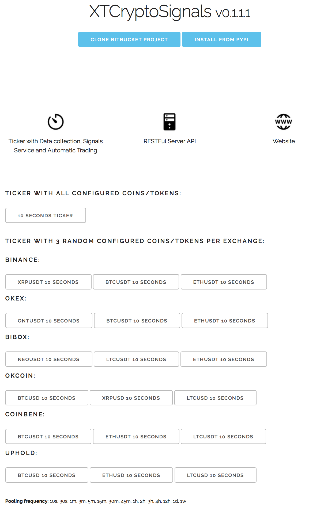
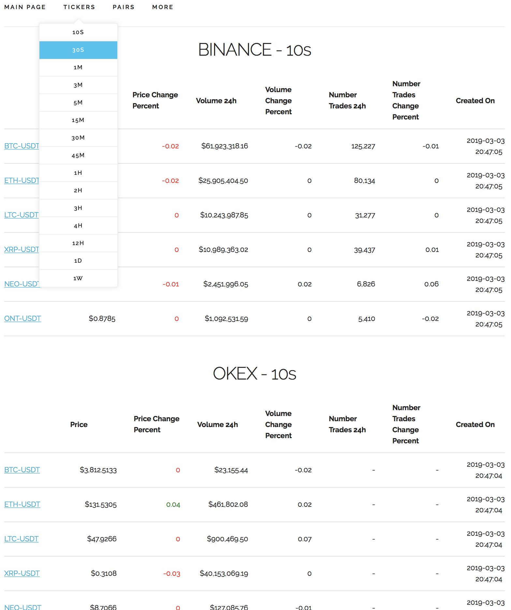

# XTCryptoSignals

**XTCryptoSignals** is a Python library that includes the following 3 services:

* #### Ticker

    * **Data collection** of crypto-currencies pairs such as BTC/USDT, ETH/BTC or any other pair that is supported by the Exchange API
    * A **Signals** service based on setup rules to send real-time alerts about price, price change, trading volume or market sentiment through E-mail or Push Notifications to the browser or mobile app
    * **Automatic trading**

* #### RESTFul Server API
    * Restful interface that exposes API entry points to get desired crypto-currencies data.
    * SocketIO Server to broadcast real-time data to clients.

* #### Website

## Roadmap

* [x] Add crypto-currencies exchanges (Dec 2018)
* [x] Implement RESTFul API and socket.io to access price data in real time (Jan 2019)
* [x] Build website (From Jan 2019)
* [x] Add Gunicorn to make it production ready (March 2019)
* [x] Building Unit, functional and end-to-end testing for existing and future features (From Jan 2019)
* [ ] Setup notification rules for price range, price change, trading volume, price sentiment (From July 2019)
* [ ] Implement e-mail and web browser push notifications signals (Aug-Oct 2019)
* [ ] Implement automatic trading (From 2019)
* [ ] Build iOS app (From 2020)


## Getting Started

### Pre-requisites

* [Python >=3.6](https://www.python.org/downloads)
* [Redis](https://redis.io/download)
* [MongoDB](https://www.mongodb.com)


## Installation

### Install from source
Clone project repository
```bash
hg clone ssh://hg@bitbucket.org/pantunes/xtcryptosignals
cd xtcryptosignals
```

Setup Python virtual environment:
```bash
virtualenv venv -p python3
source venv/bin/activate
```

Install package in develop mode:
```bash
pip install -e .
```
(Dependencies will be installed automatically from [requirements.txt](requirements.txt))

Running tests

```bash
python setup.py test
```

### Install from PyPi
Create folder project:
```bash
mkdir xtcryptosignals
cd xtcryptosignals
```

Setup Python virtual environment:
```bash
virtualenv venv -p python3
source venv/bin/activate
```

Install package:
```bash
pip install xtcryptosignals
```


## Ticker
### Start service

Development:

```bash
xt-ticker --enable-messaging

# to test 1 tick
xt-ticker --testing

```

Production

```bash
xt-ticker --enable-messaging --log-minimal
```

To get a list of supported exchanges:
```bash
xt-ticker --list-config exchanges
```
```bash
binance
binance_dex
uphold
okex
idex
switcheo
hotbit
bibox
okcoin
bithumb
coinbene
dcoin
bitmax
bilaxy
```
(Drop [me](mailto:pjmlantunes@gmail.com) an e-mail if you want support for a new exchange or please contribute to this project creating a pull request)

Command line help
```bash
xt-ticker --help
```
```bash
Usage: xt-ticker [OPTIONS]

  Use this tool to collect data from configured coins or/and tokens from
  configured crypto-currencies exchanges.

Options:
  --testing                       Execute 1 iteration for all configured coins
                                  and/or tokens without Celery. (Useful for
                                  testing purposes)
  --list-config [exchanges|currencies]
                                  List 'exchanges' or 'currencies' (coins or
                                  tokens) per exchange that the tool currently
                                  supports.
  --enable-messaging              Enable real-time crypto data message broadcasting.
  --log-minimal                   Only log errors and important warnings in
                                  stdout.
  --version                       Show version.
  -h, --help                      Show this message and exit.
```

### Setup

There is already an initial setup with some crypto-currencies (coins and tokens) that can be added or/and removed in [settings_exchanges.py](xtcryptosignals/settings_exchanges.py).

```python
BIBOX: {
    'pairs': [
        ('ONT', 'USDT'),
        ('ONT', 'BTC'),
        ('ONT', 'ETH'),
        ('NEO', 'USDT'),
        ('NEO', 'BTC'),
        ('NEO', 'ETH'),
        ('LTC', 'USDT'),
        ('LTC', 'BTC'),
        ('CARD', 'ETH'),
    ]
}

UPHOLD: {
    'pairs': [
        ('BTC', 'USD'),
        ('ETH', 'USD'),
        ('LTC', 'USD'),
        ('XRP', 'USD'),
    ]
}
```

Initial setup to create dynamic MongoDB collections for data segmentation categorized by Exchanges pooling frequency in [settings.py](xtcryptosignals/settings.py).
```python
HISTORY_FREQUENCY = (
    '10s', '30s', '1m', '10m', '30m', '1h', '2h', '3h', '4h', '12h', '1d', '4d', 
    '1w', '2w', '4w', '12w', '24w', '1y',
)
```

### Results
The Ticker service is highly performant as can take advantage of multi-processing multi-core CPU.  

### RESTFul Server API
### Start service

Development:

```bash
xt-server
```

Production:

```bash
DEBUG=0 xt-server
```


## Website
### Start service

Development:

```bash
xt-client
```

Production:
```bash
# if using default settings
DEBUG=0 SERVER_API_BASE_URL=http://127.0.0.1:5000 xt-client --gunicorn
```
`SERVER_API_BASE_URL` should contain the public address where `xt-server` was started.

## Run all services at once

```bash
xt-all --help
```

```bash
Usage: xt-all [OPTIONS] [start|stop|restart]

Options:
  -h, --help  Show this message and exit.
```

## Screenshots

Open the browser with the URL http://127.0.0.1:8000

**Home page** | **Ticker 10 seconds**
:-------------------------:|:-------------------------:
 | 
**Tickers** | **Pairs**
 | 
**BTC-USDT in all Exchanges** | 
 | 


## Team

* Paulo Antunes

anyone else interested? :-)

## Disclaimer

This project is work in progress and when it comes to trading use it at your own risk.


## License

This project is licensed under the [GNU](https://www.gnu.org/licenses/gpl-3.0.en.html) License.


## Donation

I've been building this open-source project on my free time. Feel free to pay me a coffee :-)
```bash
BTC 3QLhxkScrmzbKvUFyesxCkxMaPc7EB9SFK
ETH 0x2bda8e92B42AB005918E5A126E2bD7cC19Bf5fF6
```

##Contact Us

Through the website [xtcryptosignals.com](https://xtcryptosignals.com/#contact).  

## Acknowledgments

Thanks to [Jetbrains](https://www.jetbrains.com/?from=xtcryptosignals) in order to support us with an Open Source license.
